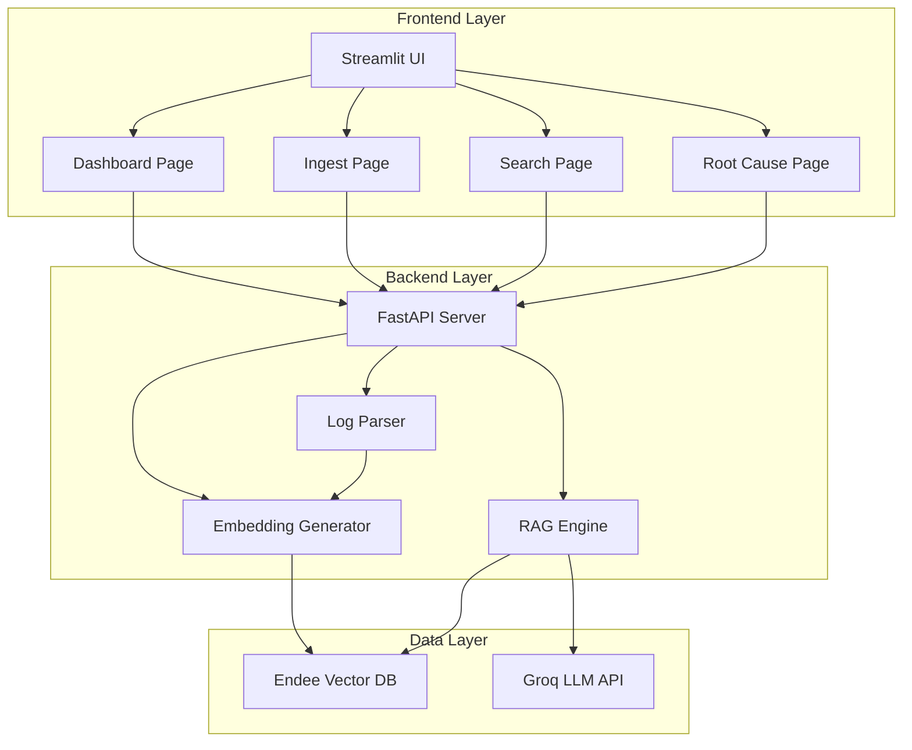
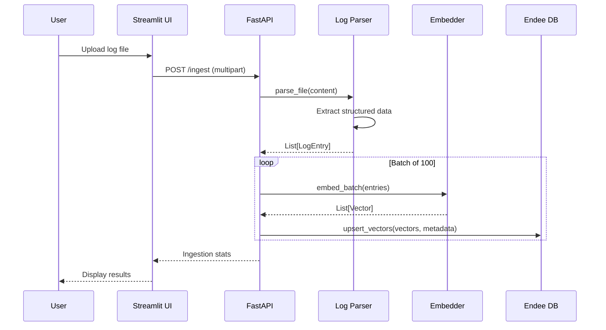
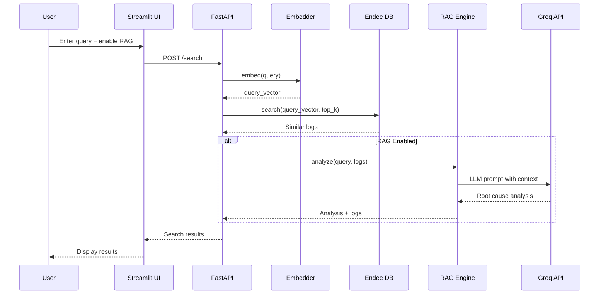
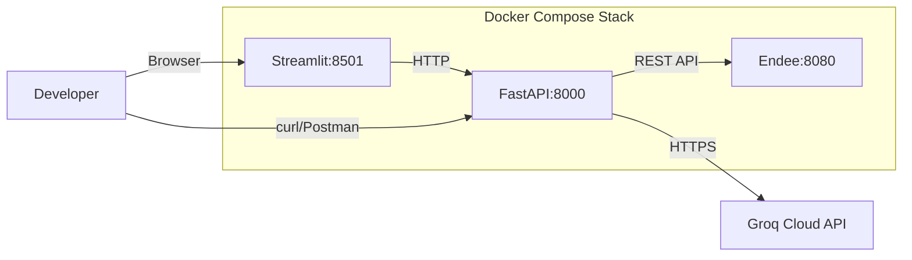

# Design Document: ErrorLens Semantic Log Analyzer

## Overview

ErrorLens is a semantic log analysis system that transforms traditional keyword-based log searching into an intelligent, meaning-aware experience. The system leverages vector embeddings and similarity search to enable natural language queries, automatic duplicate detection, and AI-powered root cause analysis.

### Core Innovation

Traditional log analysis relies on exact pattern matching (grep, regex), which fails when:
- Error messages use different wording for the same issue
- Developers don't know exact error text
- Similar errors appear with slight variations

ErrorLens solves this by converting log entries into 384-dimensional semantic vectors using the all-MiniLM-L6-v2 model ([source](https://hf.co/sentence-transformers/all-MiniLM-L6-v2)). This enables similarity-based search where "database connection failed" will match "unable to connect to DB" even though they share no common words.

### System Capabilities

1. **Semantic Search**: Natural language queries find relevant errors by meaning, not keywords
2. **Duplicate Detection**: Automatically identifies similar errors using cosine similarity thresholds
3. **RAG-Powered Analysis**: Combines retrieved log context with Groq LLM for root cause suggestions
4. **Multi-Format Support**: Parses .log, .txt, and .json log files
5. **Interactive UI**: Streamlit-based dashboard for visualization and exploration

### Technology Stack

- **Backend**: FastAPI (async REST API)
- **Frontend**: Streamlit (multi-page dashboard)
- **Embeddings**: sentence-transformers/all-MiniLM-L6-v2 (384-dim vectors)
- **Vector DB**: Endee (lightweight vector database)
- **LLM**: Groq API with llama3-8b-8192
- **Deployment**: Docker Compose

## Architecture

### High-Level Architecture



### Data Flow

#### Ingestion Flow


#### Search Flow


### Component Architecture

The system follows a layered architecture pattern ([source](https://orchestrator.dev/blog/2025-1-30-fastapi-production-patterns)):

1. **Presentation Layer**: Streamlit UI (pages/)
2. **API Layer**: FastAPI endpoints (main.py)
3. **Business Logic Layer**: Parser, Embedder, RAG Engine
4. **Data Access Layer**: Endee Client
5. **External Services**: Endee DB, Groq API

### Deployment Architecture



## Components and Interfaces

### 1. Log Parser Component

**Responsibility**: Parse multiple log formats into structured LogEntry objects

**Module**: `backend/log_parser.py`

**Key Classes**:

```python
@dataclass
class LogEntry:
    """Structured representation of a log line"""
    severity: str          # ERROR, WARN, INFO, DEBUG, UNKNOWN
    service: str           # Service name or "unknown"
    message: str           # Core error message
    timestamp: str         # ISO 8601 format or "unknown"
    raw_log: str          # Original log text
    line_number: int      # Line number in file
```

**Public Interface**:

```python
class LogParser:
    def parse_file(self, content: str, filename: str) -> List[LogEntry]:
        """Parse log file content into structured entries"""
        
    def parse_line(self, line: str, line_num: int) -> LogEntry:
        """Parse single log line"""
        
    def _parse_standard_format(self, line: str) -> Optional[Dict]:
        """Parse standard syslog format"""
        
    def _parse_json_format(self, line: str) -> Optional[Dict]:
        """Parse JSON log format"""
```

**Parsing Strategy**:
- Try JSON parsing first (for .json files or JSON lines)
- Fall back to regex patterns for standard formats
- Common patterns:
  - `[TIMESTAMP] SEVERITY [SERVICE] MESSAGE`
  - `TIMESTAMP SEVERITY SERVICE: MESSAGE`
  - `{"timestamp": ..., "level": ..., "service": ..., "message": ...}`
- Unknown format → severity="UNKNOWN", preserve raw text

### 2. Embedder Component

**Responsibility**: Generate 384-dimensional semantic vectors from text

**Module**: `backend/embedder.py`

**Public Interface**:

```python
class Embedder:
    def __init__(self, model_name: str = "all-MiniLM-L6-v2"):
        """Initialize with sentence-transformers model"""
        
    def embed(self, text: str) -> List[float]:
        """Generate embedding for single text"""
        
    def embed_batch(self, texts: List[str]) -> List[List[float]]:
        """Generate embeddings for batch of texts"""
        
    def embed_log_entry(self, entry: LogEntry) -> List[float]:
        """Generate embedding from LogEntry fields"""
```

**Implementation Details**:
- Model: `sentence-transformers/all-MiniLM-L6-v2` (22M parameters, 90MB)
- Output: 384-dimensional float vectors
- Normalization: Vectors normalized to unit length for cosine similarity
- Caching: Model loaded once and cached in memory
- Batch processing: Use batch encoding for efficiency

**Text Composition for Embedding**:
```python
embedding_text = f"{severity} {service}: {message}"
```

This combines key fields to capture semantic meaning while keeping context compact.

### 3. Endee Client Component

**Responsibility**: Interface with Endee vector database REST API

**Module**: `backend/endee_client.py`

**Public Interface**:

```python
class EndeeClient:
    def __init__(self, base_url: str = "http://localhost:8080"):
        """Initialize client with Endee URL"""
        
    def create_collection(self, name: str, dimension: int, metric: str) -> bool:
        """Create vector collection"""
        
    def collection_exists(self, name: str) -> bool:
        """Check if collection exists"""
        
    def upsert_vectors(self, collection: str, vectors: List[Dict]) -> bool:
        """Insert or update vectors with metadata"""
        
    def search(self, collection: str, query_vector: List[float], 
               top_k: int, threshold: float = 0.3) -> List[Dict]:
        """Search for similar vectors"""
        
    def delete_collection(self, name: str) -> bool:
        """Delete collection"""
        
    def get_stats(self, collection: str) -> Dict:
        """Get collection statistics"""
```

**Endee API Mapping**:

| Operation | HTTP Method | Endpoint | Payload |
|-----------|-------------|----------|---------|
| Create Collection | POST | `/collections` | `{name, dimension, metric}` |
| Upsert Vectors | POST | `/collections/{name}/upsert` | `{vectors: [{id, vector, metadata}]}` |
| Search | POST | `/collections/{name}/search` | `{vector, top_k}` |
| Delete Collection | DELETE | `/collections/{name}` | - |
| Get Stats | GET | `/collections/{name}/stats` | - |

**Vector Metadata Schema**:
```json
{
  "id": "log_<timestamp>_<line_number>",
  "vector": [0.123, -0.456, ...],  // 384 dimensions
  "metadata": {
    "severity": "ERROR",
    "service": "auth_service",
    "timestamp": "2024-01-15T10:30:45Z",
    "raw_log": "Original log text...",
    "line_number": 42
  }
}
```

### 4. RAG Engine Component

**Responsibility**: Combine vector search results with LLM for root cause analysis

**Module**: `backend/rag_engine.py`

**Public Interface**:

```python
class RAGEngine:
    def __init__(self, endee_client: EndeeClient, embedder: Embedder, 
                 groq_api_key: str):
        """Initialize RAG engine with dependencies"""
        
    def analyze(self, query: str, top_k: int = 5) -> Dict:
        """Perform RAG analysis for query"""
        
    def _build_prompt(self, query: str, logs: List[Dict]) -> str:
        """Construct LLM prompt with retrieved context"""
        
    def _call_groq(self, prompt: str) -> str:
        """Call Groq API for completion"""
```

**RAG Pipeline**:

1. **Retrieval Phase**:
   - Embed user query
   - Search Endee for top-5 similar logs
   - Filter by similarity threshold (>0.3)

2. **Augmentation Phase**:
   - Construct prompt with retrieved logs as context
   - Include query and log details (severity, service, message)

3. **Generation Phase**:
   - Send prompt to Groq API (llama3-8b-8192 model)
   - Parse structured response

**Prompt Template**:
```
You are an expert system administrator analyzing error logs.

User Query: {query}

Retrieved Similar Errors:
1. [{severity}] {service}: {message} (similarity: {score})
2. [{severity}] {service}: {message} (similarity: {score})
...

Based on these error patterns, provide:
1. Root Cause Analysis: What is likely causing these errors?
2. Fix Suggestions: What steps should be taken to resolve this?
3. Prevention: How can similar errors be prevented?

Keep your response concise and actionable.
```

**Response Format**:
```json
{
  "query": "database connection errors",
  "retrieved_logs": [
    {"severity": "ERROR", "service": "api", "message": "...", "similarity": 0.92}
  ],
  "analysis": {
    "root_cause": "...",
    "fix_suggestions": "...",
    "prevention": "..."
  }
}
```

### 5. Backend API Component

**Responsibility**: Expose REST endpoints for log ingestion, search, and management

**Module**: `backend/main.py`

**Framework**: FastAPI with async/await support

**API Endpoints**:

#### POST /ingest
Upload and process log files

**Request**:
```
Content-Type: multipart/form-data
file: <log file>
```

**Response**:
```json
{
  "status": "success",
  "filename": "app.log",
  "stats": {
    "total_lines": 1000,
    "parsed": 985,
    "failed": 15,
    "processing_time_seconds": 2.3
  }
}
```

**Processing**:
1. Validate file size (<50MB)
2. Parse file content
3. Batch embed entries (100 per batch)
4. Upsert to Endee
5. Return statistics

#### POST /search
Search logs semantically

**Request**:
```json
{
  "query": "authentication failures",
  "top_k": 10,
  "rag_enabled": true
}
```

**Response** (RAG disabled):
```json
{
  "query": "authentication failures",
  "results": [
    {
      "severity": "ERROR",
      "service": "auth_service",
      "message": "Invalid credentials for user",
      "timestamp": "2024-01-15T10:30:45Z",
      "raw_log": "...",
      "similarity_score": 0.94
    }
  ],
  "count": 10
}
```

**Response** (RAG enabled):
```json
{
  "query": "authentication failures",
  "results": [...],
  "rag_analysis": {
    "root_cause": "...",
    "fix_suggestions": "...",
    "prevention": "..."
  }
}
```

#### GET /health
Health check endpoint

**Response**:
```json
{
  "status": "healthy",
  "endee_connected": true,
  "model_loaded": true
}
```

#### GET /stats
Collection statistics

**Response**:
```json
{
  "collection": "error_logs",
  "vector_count": 5000,
  "dimension": 384,
  "metric": "cosine"
}
```

#### DELETE /reset
Reset collection (delete and recreate)

**Response**:
```json
{
  "status": "success",
  "message": "Collection reset successfully"
}
```

**Error Handling**:
- 400: Validation errors (empty query, invalid top_k)
- 503: Endee unavailable
- 500: Internal server errors

### 6. Frontend UI Component

**Responsibility**: Interactive web interface for log analysis

**Module**: `frontend/streamlit_app.py` and `frontend/pages/`

**Framework**: Streamlit multi-page app

**Page Structure**:

```
frontend/
├── streamlit_app.py          # Main entry point
└── pages/
    ├── 1_📊_Dashboard.py     # Error distribution visualization
    ├── 2_📤_Ingest.py        # File upload interface
    ├── 3_🔍_Search.py        # Semantic search interface
    └── 4_🧠_Root_Cause.py    # RAG analysis interface
```

**Page Designs**:

#### Dashboard Page
- **Purpose**: Visualize error distribution and statistics
- **Components**:
  - KPI cards: Total errors, unique services, time range
  - Bar chart: Errors by severity
  - Pie chart: Errors by service
  - Line chart: Errors over time (if timestamps available)
- **Data Source**: GET /stats + aggregation from search results

#### Ingest Page
- **Purpose**: Upload log files for processing
- **Components**:
  - File uploader (accepts .log, .txt, .json)
  - File size validation (<50MB)
  - Progress indicator during upload
  - Results display: stats table with parsed/failed counts
- **API Call**: POST /ingest

#### Search Page
- **Purpose**: Semantic search interface
- **Components**:
  - Text input: Query field
  - Slider: top_k (1-100, default 10)
  - Toggle: RAG mode
  - Search button
  - Results table: severity, service, message, similarity %
  - Expandable raw log view
- **API Call**: POST /search

#### Root Cause Page
- **Purpose**: Display AI-powered analysis
- **Components**:
  - Query input (pre-filled from search)
  - Retrieved logs context display
  - Analysis sections:
    - Root Cause (highlighted)
    - Fix Suggestions (numbered list)
    - Prevention Tips
  - Similarity scores for retrieved logs
- **API Call**: POST /search with rag_enabled=true

**UI Design Principles**:
- Clean, minimal interface
- Responsive layout using Streamlit columns
- Color coding: ERROR (red), WARN (yellow), INFO (blue), DEBUG (gray)
- Similarity scores displayed as percentages
- Error messages displayed with st.error()

## Data Models

### LogEntry Model

```python
from dataclasses import dataclass
from typing import Optional

@dataclass
class LogEntry:
    """Structured log entry"""
    severity: str          # ERROR, WARN, INFO, DEBUG, UNKNOWN
    service: str           # Service identifier
    message: str           # Error message
    timestamp: str         # ISO 8601 or "unknown"
    raw_log: str          # Original text
    line_number: int      # Line number in file
    
    def to_embedding_text(self) -> str:
        """Generate text for embedding"""
        return f"{self.severity} {self.service}: {self.message}"
    
    def to_metadata(self) -> dict:
        """Convert to Endee metadata format"""
        return {
            "severity": self.severity,
            "service": self.service,
            "timestamp": self.timestamp,
            "raw_log": self.raw_log,
            "line_number": self.line_number
        }
```

### SearchResult Model

```python
from pydantic import BaseModel, Field
from typing import List, Optional

class SearchResult(BaseModel):
    """Single search result"""
    severity: str
    service: str
    message: str
    timestamp: str
    raw_log: str
    similarity_score: float = Field(ge=0.0, le=1.0)

class SearchResponse(BaseModel):
    """Search API response"""
    query: str
    results: List[SearchResult]
    count: int
    rag_analysis: Optional[dict] = None
```

### IngestionStats Model

```python
class IngestionStats(BaseModel):
    """Ingestion result statistics"""
    status: str  # "success" or "error"
    filename: str
    stats: dict = {
        "total_lines": int,
        "parsed": int,
        "failed": int,
        "processing_time_seconds": float
    }
```

### RAGAnalysis Model

```python
class RAGAnalysis(BaseModel):
    """RAG analysis result"""
    root_cause: str
    fix_suggestions: str
    prevention: str
```

### Endee Vector Schema

Endee stores vectors with the following structure:

```json
{
  "id": "string",           // Unique identifier: log_<timestamp>_<line_num>
  "vector": [float],        // 384-dimensional embedding
  "metadata": {
    "severity": "string",   // ERROR, WARN, INFO, DEBUG, UNKNOWN
    "service": "string",    // Service name
    "timestamp": "string",  // ISO 8601 format
    "raw_log": "string",    // Original log text
    "line_number": "int"    // Line number in source file
  }
}
```

**Collection Configuration**:
- Name: `error_logs`
- Dimension: 384
- Metric: `cosine` (for normalized vectors)

## Error Handling

### Error Categories

1. **Validation Errors** (HTTP 400)
   - Empty query text
   - Invalid top_k range (must be 1-100)
   - File size exceeds 50MB
   - Unsupported file format

2. **Service Unavailable** (HTTP 503)
   - Endee database unreachable
   - Groq API unavailable

3. **Internal Errors** (HTTP 500)
   - Parsing failures
   - Embedding generation errors
   - Unexpected exceptions

### Error Handling Strategy

**Backend API**:
```python
from fastapi import HTTPException

# Validation errors
if not query.strip():
    raise HTTPException(status_code=400, detail="Query cannot be empty")

# Service errors
try:
    results = endee_client.search(...)
except ConnectionError:
    raise HTTPException(status_code=503, detail="Vector database unavailable")

# Internal errors
try:
    embeddings = embedder.embed_batch(texts)
except Exception as e:
    logger.error(f"Embedding error: {e}")
    raise HTTPException(status_code=500, detail="Internal processing error")
```

**Frontend UI**:
```python
import streamlit as st

try:
    response = requests.post(f"{API_URL}/search", json=payload)
    response.raise_for_status()
    data = response.json()
except requests.exceptions.ConnectionError:
    st.error("❌ Cannot connect to backend API")
except requests.exceptions.HTTPError as e:
    st.error(f"❌ API Error: {e.response.json().get('detail', 'Unknown error')}")
except Exception as e:
    st.error(f"❌ Unexpected error: {str(e)}")
```

**RAG Engine**:
- Graceful degradation: If Groq API fails, return search results without analysis
- Timeout handling: 30-second timeout for LLM calls
- Retry logic: Single retry with exponential backoff

**Logging Strategy**:
- Use Python `logging` module
- Log levels:
  - INFO: Successful operations, ingestion stats
  - WARNING: Parsing failures, missing API keys
  - ERROR: Service failures, unexpected exceptions
- Log format: `[TIMESTAMP] LEVEL [COMPONENT] MESSAGE`

## Testing Strategy

### Unit Testing

**Test Framework**: pytest

**Test Coverage**:

1. **Log Parser Tests** (`tests/test_log_parser.py`)
   - Parse standard log formats
   - Parse JSON log formats
   - Handle malformed lines (UNKNOWN severity)
   - Preserve raw log text
   - Extract timestamps correctly

2. **Embedder Tests** (`tests/test_embedder.py`)
   - Generate 384-dimensional vectors
   - Normalize vectors to unit length
   - Batch embedding consistency
   - Model caching behavior

3. **Endee Client Tests** (`tests/test_endee_client.py`)
   - Collection creation
   - Vector upsert
   - Search functionality
   - Error handling for connection failures
   - Use mocked HTTP responses

4. **RAG Engine Tests** (`tests/test_rag_engine.py`)
   - Prompt construction
   - Response parsing
   - Graceful degradation when Groq unavailable
   - Use mocked Groq API responses

5. **API Endpoint Tests** (`tests/test_api.py`)
   - Test all endpoints with FastAPI TestClient
   - Validation error responses
   - Success responses
   - Error handling

**Example Test**:
```python
def test_parse_standard_log():
    parser = LogParser()
    line = "[2024-01-15T10:30:45Z] ERROR [auth_service] Invalid credentials"
    entry = parser.parse_line(line, 1)
    
    assert entry.severity == "ERROR"
    assert entry.service == "auth_service"
    assert entry.message == "Invalid credentials"
    assert entry.timestamp == "2024-01-15T10:30:45Z"
    assert entry.raw_log == line
```

### Integration Testing

**Test Scenarios**:

1. **End-to-End Ingestion**
   - Upload sample log file
   - Verify vectors stored in Endee
   - Check ingestion statistics

2. **End-to-End Search**
   - Ingest test logs
   - Perform semantic search
   - Verify results ranked by similarity

3. **RAG Pipeline**
   - Search with RAG enabled
   - Verify LLM response structure
   - Check retrieved context included

**Test Environment**:
- Use Docker Compose test stack
- Separate test Endee collection
- Mock Groq API for deterministic tests

### Manual Testing

**Test Checklist**:
- [ ] Upload .log, .txt, .json files
- [ ] Search with various natural language queries
- [ ] Verify duplicate detection (similarity >0.85)
- [ ] Test RAG analysis quality
- [ ] Verify UI responsiveness
- [ ] Test error handling (invalid files, empty queries)
- [ ] Check health endpoint
- [ ] Test reset functionality

### Performance Testing

**Benchmarks**:
- Ingestion: >100 logs/second
- Search latency: <500ms for top-10 results
- Embedding generation: <100ms for single entry
- RAG analysis: <5 seconds end-to-end

**Load Testing**:
- Test with 10,000+ log entries
- Concurrent search requests (10 simultaneous users)
- Large file upload (50MB)

---

*This design document provides the technical blueprint for implementing ErrorLens. All components follow modern Python best practices with type hints, async/await patterns, and comprehensive error handling. The architecture is modular and testable, with clear separation of concerns between parsing, embedding, storage, and presentation layers.*


## Correctness Properties

*A property is a characteristic or behavior that should hold true across all valid executions of a system—essentially, a formal statement about what the system should do. Properties serve as the bridge between human-readable specifications and machine-verifiable correctness guarantees.*

### Property 1: Log Parsing Information Preservation

*For any* log line (valid or malformed), when parsed by the Log_Parser, the resulting LogEntry SHALL contain all extractable fields (severity, service, message, timestamp) AND preserve the complete original raw log text in the raw_log field.

**Validates: Requirements 1.1, 1.6**

### Property 2: JSON Log Parsing Correctness

*For any* valid JSON log object containing log fields, when parsed by the Log_Parser, the resulting LogEntry SHALL correctly extract all fields from the JSON structure.

**Validates: Requirements 1.3**

### Property 3: Malformed Log Graceful Handling

*For any* unparseable or malformed log line, when processed by the Log_Parser, the resulting LogEntry SHALL have severity set to "UNKNOWN" AND preserve the complete original text in raw_log.

**Validates: Requirements 1.4**

### Property 4: Embedding Dimension Invariant

*For any* text input, when processed by the Embedder, the resulting vector SHALL have exactly 384 dimensions.

**Validates: Requirements 2.1**

### Property 5: Embedding Text Composition

*For any* LogEntry, when converted to embedding text by the Embedder, the resulting string SHALL follow the format "{severity} {service}: {message}".

**Validates: Requirements 2.2**

### Property 6: Vector Normalization Invariant

*For any* text input, when embedded by the Embedder, the resulting vector SHALL have unit length (magnitude = 1.0 within floating-point tolerance of 1e-6).

**Validates: Requirements 2.3**

### Property 7: Batch Embedding Consistency

*For any* list of text inputs, when processed by the Embedder, batch embedding SHALL produce identical vectors to individual embedding for each input.

**Validates: Requirements 2.4**

### Property 8: Search Results Sorting

*For any* search query returning multiple results, the Backend_API SHALL return results sorted by Similarity_Score in strictly descending order.

**Validates: Requirements 4.2**

### Property 9: Top-K Result Constraint

*For any* search query with top_k parameter, the Backend_API SHALL return at most top_k results (result count <= top_k).

**Validates: Requirements 4.3**

### Property 10: Search Response Schema Completeness

*For any* search result returned by the Backend_API, the result SHALL include all required fields: Similarity_Score, severity, service, timestamp, and raw_log.

**Validates: Requirements 4.4**

### Property 11: Duplicate Detection Threshold

*For any* pair of log entries with computed Similarity_Score above 0.85, the ErrorLens_System SHALL mark them as potential duplicates.

**Validates: Requirements 5.2**

### Property 12: RAG Prompt Construction Completeness

*For any* RAG analysis request with retrieved logs, the constructed prompt SHALL include the user query AND all retrieved log details (severity, service, message, similarity score).

**Validates: Requirements 6.2**

### Property 13: RAG Response Structure Completeness

*For any* RAG analysis response, the response SHALL contain all required fields: root_cause, fix_suggestions, and prevention.

**Validates: Requirements 6.4**

### Property 14: RAG Context Inclusion

*For any* RAG analysis response, the response SHALL include the retrieved log context used for analysis.

**Validates: Requirements 6.6**

### Property 15: Ingestion Statistics Completeness

*For any* file ingestion operation, the Backend_API SHALL return statistics containing all required fields: total_lines, parsed, failed, and processing_time_seconds.

**Validates: Requirements 7.3**

### Property 16: Top-K Parameter Validation

*For any* search request, when top_k is provided, the Backend_API SHALL validate that top_k is between 1 and 100 (inclusive), rejecting out-of-range values with HTTP 400.

**Validates: Requirements 8.4**

### Property 17: Similarity Score Percentage Formatting

*For any* similarity score value between 0.0 and 1.0, when displayed by the Frontend_UI, the score SHALL be formatted as a percentage between 0% and 100%.

**Validates: Requirements 10.5**

